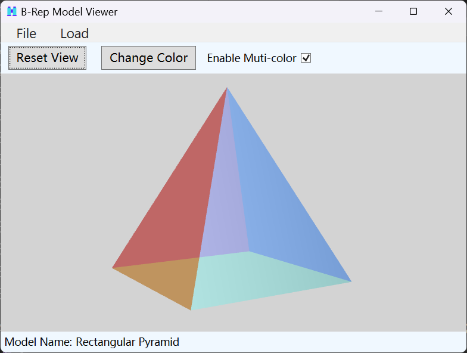
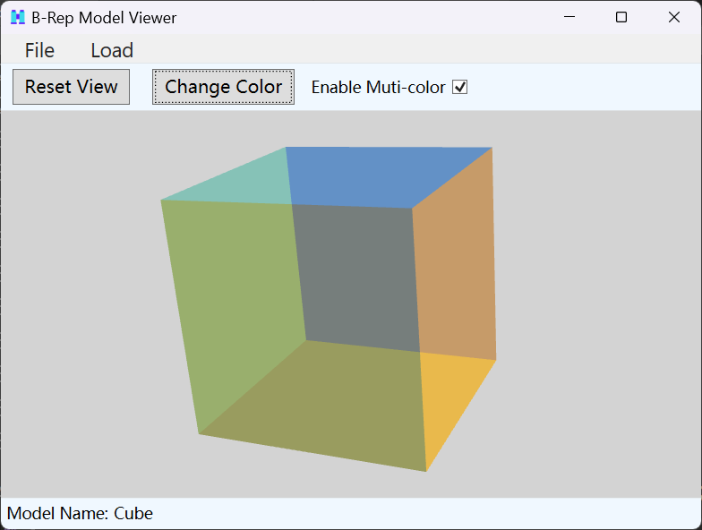

# B-Rep Model Viewer

Homework for BUAA 2023 Autumn Computer Aided Design And Manufacturing.

Copyright &copy; Tony's Studio 2023

---

## Reference

1. https://www.codeproject.com/Articles/23332/WPF-3D-Primer
2. <https://xoax.net/blog/rendering-transparent-3d-surfaces-in-wpf-with-c/>
3. <https://stackoverflow.com/questions/48924505/how-to-handle-diffuse-material-transparency-in-wpf-3d>

> Thanks very much! 😆

---

## Screenshot

---

## How to use?

### Interaction

- Left click and drag to rotate the model
- Right click and drag to translate the model (This will cause the change of rotation center)
- Scroll the mouse wheel to zoom the model
- Click Reset View button to reset the view
- Click Change Color button to change the color of the model (Not for default model)
- Check Enable Muti-color to show each face of the model in different color (Not for default model)

### Menu

- File | About: Show about information
- File | Help: Show help information
- File | Exit: Exit the program
- Load | Default Model: Load the default model
- Load | From File...: Load model from file

---

## How to build?

It is developed with C# WPF and .NET 6 in Visual Studio 2022 Community. So you just need to open the `.sln`, then build and run.

The working directory of the project is set to `Work\` directory under the project root folder. And it contains 3 sample models - `Cube.json`, `Rectangular Pyramid.json` and `Stair.json`.

---

## Limitations

- Cannot handle models with holes
- In theory, can only handle convex polyhedron. Simple concave polyhedron (such as the `Stair.json`) can be created with delicately constructed data
- When Muti-color enabled, there may be rendering error in certain view angle caused by the failure of Z-Test